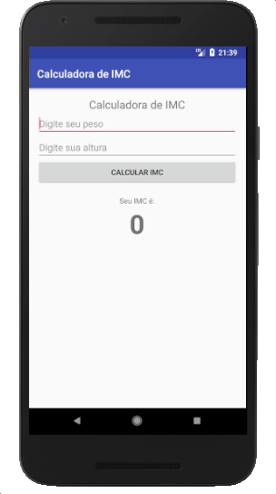

# Calculadora de IMC


Faça um aplicativo que calcule o IMC de uma pessoa. Para calcular o IMC é necessário dividir o peso da pessoa pela altura ao quadrado:

```kotlin

val imc = peso / (altura * altura)

```

O aplicativo deve ter o seguinte layout:




